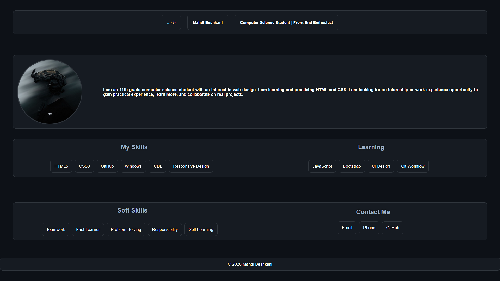
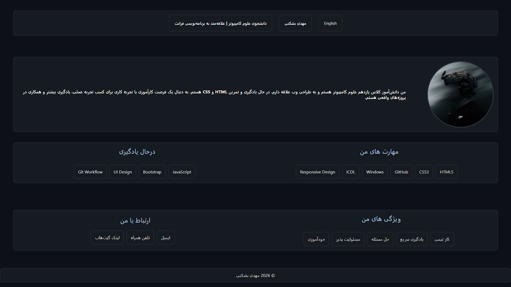

# 👋 Hi, I'm Mahdi Beshkani

I'm an 11th-grade Computer Science student from Mashhad, Iran.  
I'm passionate about Front-End Development and currently learning modern web technologies.

This repository contains my personal portfolio website, built to introduce myself, showcase my skills, and document my learning journey.

---

## 🌐 Live Demo

👉 **[View the Portfolio](https://mahdi-beshkani.github.io/Personal-Portfolio/)**

---

## ✨ Features

- 🌍 Bilingual Portfolio (English / فارسی)
- 🔄 Easy Language Switching
- 📱 Fully Responsive Design
- 🎨 Clean & Modern UI
- 👤 Personal Introduction
- 💻 Skills & Learning Roadmap
- 🤝 Soft Skills Section
- 📬 Contact Information

---

## 🚀 About Me

- 🎓 11th Grade Computer Science Student
- 💻 Passionate about Front-End Development
- 📚 Currently learning JavaScript
- 🌱 Always improving through practice and personal projects
- 🤝 Looking for internship and work experience opportunities

---

## 🛠 Technologies

- HTML5
- CSS3
- Git
- GitHub
- Responsive Design
- Windows
- ICDL

---

## 📖 Currently Learning

- JavaScript
- Bootstrap
- UI Design
- Git Workflow

---

## 📂 Project Structure

```text
Personal-Portfolio/
│
├── css/
├── font/
├── img/
├── js/
├── index.html
├── fa.html
└── README.md
```

---

## 📸 Preview

### 🇬🇧 English Version



### 🇮🇷 Persian Version



---

## 📬 Contact

📧 **Email**  
beshkani.work@gmail.com

🐙 **GitHub**  
https://github.com/Mahdi-Beshkani

---

## ⭐ Future Goals

- Learn JavaScript deeply
- Learn React
- Build real-world projects
- Improve UI/UX skills
- Become a Front-End Developer

---

## 📄 License

This project is open-source and available for learning and educational purposes.

---

Made with ❤️ by **Mahdi Beshkani**